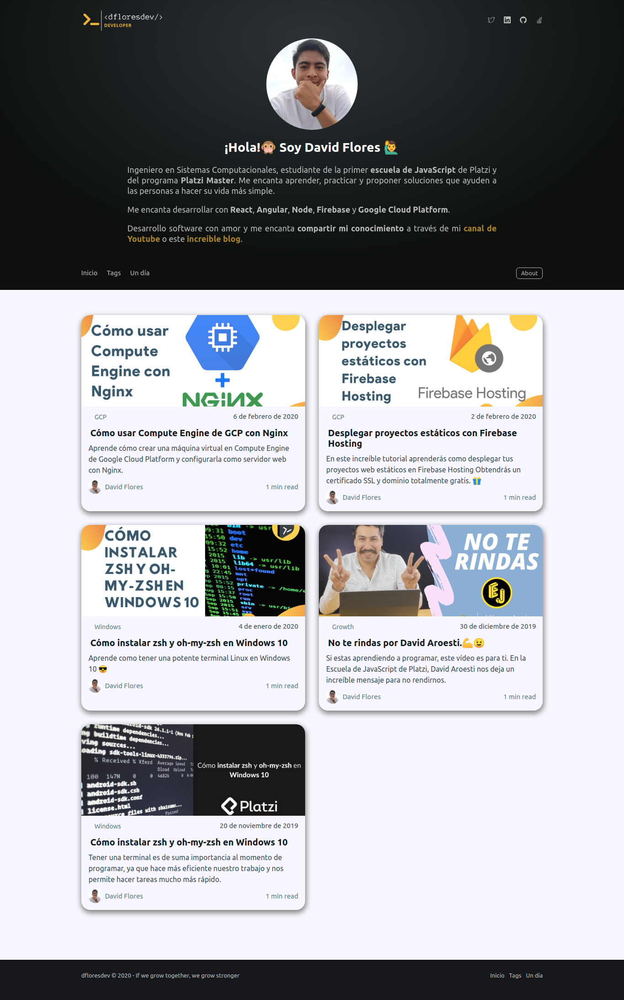

# My personal blog 👨‍💻

In this blog you can find different interesting topics

#### See my fabulous blog [here](https://dflores.dev)

## Description

The infraestructure is monolithic

-   **Frontend:** It was built with [gatsby and Ghost](https://www.gatsbyjs.org/starters/TryGhost/gatsby-starter-ghost/), that create a incredible website
-   **Backend:** i deploy Ghost in [Google Cloud Platform](https://cloud.google.com/), setting up a virtual machine (Compute Engine), cloud DNS and DNSSEC :sunglasses:
-   **Netlify:** use this CI with github to automation the deploy

Yes, i know, sounds complicated but see run the app it's beautiful

&nbsp;

## It's Alive (wireframe)



## How to use the project?

#### Step 1

Install [gatsby CLI](https://www.gatsbyjs.org/docs/quick-start/)

```bash
npm install -g gatsby-cli
```

#### Step 2

Run the next command in your terminal

```bash
npm run install
```

#### Step 3

Run the project with the hot-reloading

```bash
npm run dev
```

# Follow me [dflores.dev](https://dflores.dev/)

## Anywhere @dfloresdev
